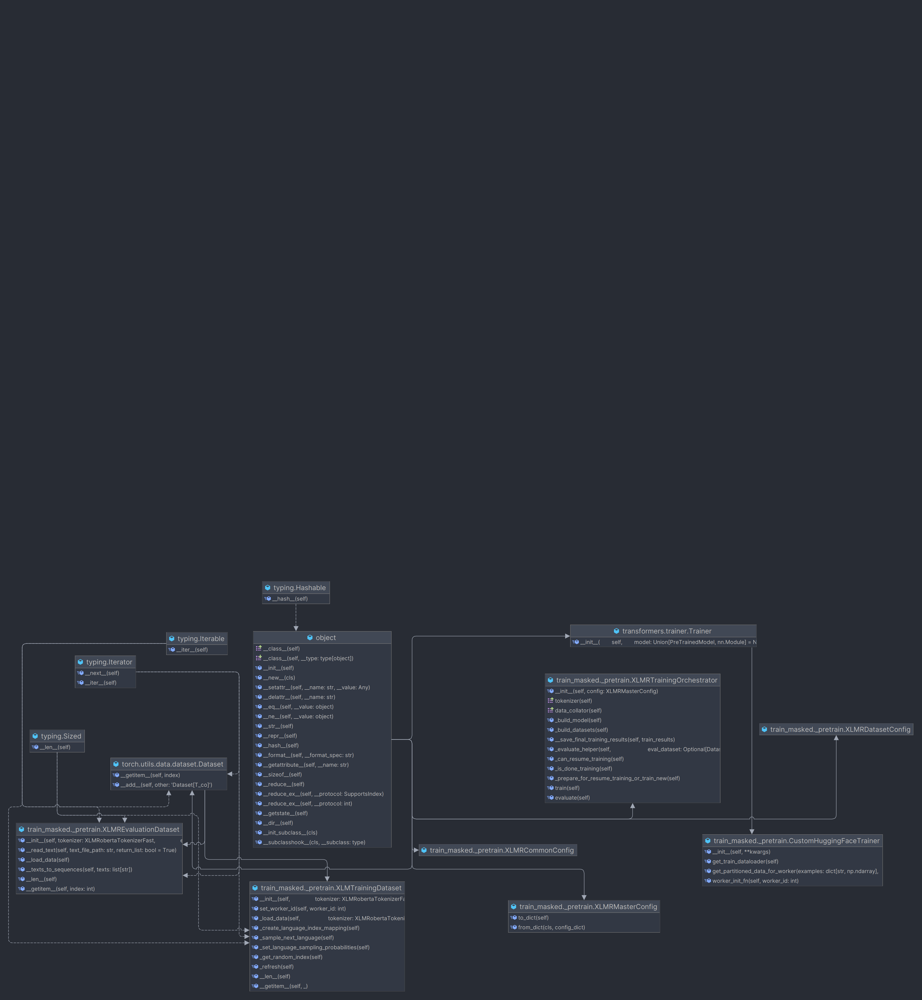

# Pre-Training Masked Language Models From Scratch using XLM-R

> Multi-lingual large language models like XLM-Roberta have been shown to be a promising way to addesss the challenge of
> lack of representation of low-resource languages in NLP models. By leveraging cross-lingual transfer learning, these
> models aim to use available data from high-resource languages to improve performance on low-resource languages with 
> limited training data.

* Ref: `train_masked._pretrain.py`

## Overview

This page provides a detailed guide to the `_pretrain` module, which enables pretraining of
[Masked Language Models (MLMs)](https://huggingface.co/transformers/model_doc/xlmroberta.html#xlmrobertaformaskedlm)
following the [XLM-R](https://huggingface.co/transformers/model_doc/xlmroberta.html) architecture.

The main components of the module include:

1. **Custom training configurations classes** - Used to define abstractions for the yaml configuration files that
   specify the training parameters. These configurations are defined under the `configs` folder.

2. **Custom dataset classes** - Used to define custom `torch.utils.data.Dataset` classes that handle the loading of
   training and evaluation data and making it available for
   the [Hugging Face Trainer](https://huggingface.co/transformers/main_classes/trainer.html).

3. **Training Ochestration class** - Used to define the main class that orchestrates the training process. This class
   manages the initialization of the model, tokenizer, data loaders, and calling the Hugging Face Trainer to start the
   training process.

## API

Config Classes

- **XLMRDatasetConfig:** Specifies paths and patterns for training and evaluation data, along with parameters for data
  filtering and splitting.
- **XLMRCommonConfig:** Contains general configuration like logging level, model naming, and training modes (e.g., train
  only, evaluate only).
- **XLMRMasterConfig:** Acts as an aggregator for all other configuration classes. This is the config
  that is passed to the training orchestrator class to initialize the training process.

Dataset Classes

- **XLMRTrainingDataset:** Handles the training dataset, implementing custom logic for loading data from multiple
  languages and supporting random sampling of languages per batch.
- **XLMREvaluationDataset:** Manages loading and tokenization of the evaluation data.

Training Classes

- **CustomHuggingFaceTrainer:** Extends the Hugging Face Trainer class with custom data loading logic to support the
  unique requirements of training with data from multiple languages.
- **XLMRTrainingOrchestrator:** Orchestrates the training process, including model and dataset preparation,
  training execution, and evaluation.

## Usage

* To use this module for training a multi-lingual language model, clients should:
    1. Load the training configuration from a YAML file - see `configs` folder.
    2. Create an instance of `XLMRMasterConfig` using the loaded configuration. You can optionally override specific
       parameters from command line options if needed.
    3. Initialize `XLMRTrainingOrchestrator` with the master configuration.
    4. Call the train method on the orchestrator instance to start training.

```python
import yaml
from _pretrain import XLMRTrainingOrchestrator, XLMRMasterConfig

# Load configuration
config_dict = yaml.safe_load(open("path/to/config.yaml"))
config = XLMRMasterConfig.from_dict(config_dict)

# Initialize training orchestrator
orchestrator = XLMRTrainingOrchestrator(config)

# Start training
orchestrator.train()
```

## Data Preparation

* We use [Map-style Torch Dataset](https://pytorch.org/docs/stable/data.html#map-style-datasets) classes to handle
  data loading and tokenization.
* This dataset is used by the `DatasetLoader` to get the next item for training using the `__getitem__` method.

### `XLMRTrainingDataset` class

* This class is responsible for loading and tokenizing the training data.

#### A. Data Loading

* Given a starting `train_data_dir` - loads training data from files in the format `train.{lang}` (e.g., train.ven for
  Tshivenda)
* Encoding raw sentences into tokenized inputs using the model's tokenizer. For example:

```python
from transformers import XLMRobertaTokenizerFast

tokenizer = XLMRobertaTokenizerFast.from_pretrained("zulu-xlmlr-base")
original_sentence = "Ngiyabonga, kuhle kakhulu!"
tokenized_input = tokenizer(original_sentence, return_tensors="pt")

# Sample output
# {
#     'input_ids': tensor([[0, 2, 3, 4, 5, 6, 7, 8, 9, 10, 11, 12, 13, 14, 15, 16, 17, 1]]),
#     'attention_mask': tensor([[...]])
# }
```

* Each input_id is a tokenized representation of the sentence, with the first and last tokens being the special
  tokens to indicate the start(usually `<s>`) and end(usually `</s>`) of the sentence respectively.
* The attention_mask tensor is used to mask out padding tokens during training. This ensures that the model does not
  consider padding tokens when making predictions.
* In addition to reading raw text file and tokenizing them, the `_load_data` method will also maintain the following info:
    * The number of sentences per language e.g. `{'zulu': 1000, 'tshivenda': 500}`
    * The total number of sentences across all languages
    * An `np.array` of `input_ids` for each language. For example
   ```json
  {
   'zulu': [
      {'input_ids': tensor([[0, 2, 3, 4, 5, 6, 7, 8, 9, 10, 11, 12, 13, 14, 15, 16, 17, 1]]),
      {'input_ids': tensor([[0, 2, 3, 4, 5, 6, 7, 8, 9, 10, 11, 12, 13, 14, 15, 16, 17, 1]]),
    ...
    ],
  'tshivenda': [
          {'input_ids': tensor([[0, 2, 3, 4, 5, 6, 7, 8, 9, 10, 11, 12, 13, 14, 15, 16, 17, 1]]),
          {'input_ids': tensor([[0, 2, 3, 4, 5, 6, 7, 8, 9, 10, 11, 12, 13, 14, 15, 16, 17, 1]]),
          ...
          ]
  }
  ```
  * Finally we also keep a set of all unique language codes in the dataset. We recommend using 
  [ISO 639-3](https://en.wikipedia.org/wiki/ISO_639-3) language codes as suffixes for the training data files.

 > **Potential improvements:** We currently load all data into memory during initialization. This may not be feasible for large datasets or as
  the number of languages increases. To reduce memory usage, consider loading data lazily or using memory-mapped files
 

#### B. Data Sampling

* To obtain the next batch of examples to train on, the `XLMRTrainingDataset` class implements a custom `__getitem__`
  method.
* Internally, this method is used by the `DatasetLoader` and `DataCollatorForLanguageModeling` to get the next item for 
training.
* **Note:** For the sake of efficieny we sample multiple sentences to train with instead of just one. 
* **In summary:** `getitem` performs the following steps:
    1. Gets a collection of sentences or batch of input_ids for the current language.
    2. Bascially, in each batch, we can only sample sentences from ONE language.
    3. If we have reached the end of the current batch, we randomly select the next language to sample from.
* Example:

```python
# Let's assume we are traing on 3 languages: zulu, sepedi and tshivenda
data = {'zul': ..., 'tshivenda': ...}
batch_size = 32

# Get Batch 1 samples
lang = 'zulu'  # randomly selected
batch_source = data[lang]
# Fill-up the batch with samples from the current language
for i in range(0, len(batch_source), batch_size):
    batch = batch_source[i:i + batch_size]
    # Use the batch for training and update the model


# Get Batch 2 samples
lang = 'tshivenda'  # randomly selected - could be zulu again
batch_source = data[lang]
# Fill-up the batch with samples from the current language
for i in range(0, len(batch_source), batch_size):
    batch = batch_source[i:i + batch_size]
    # Use the batch for training and update the model


# Get Batch 3 samples
lang = 'sepedi'  # randomly selected - could be zulu or tshivenda again
batch_source = data[lang]
# Fill-up the batch with samples from the current language
for i in range(0, len(batch_source), batch_size):
    batch = batch_source[i:i + batch_size]
    # Use the batch for training and update the model
```


#### C. Sampling probabilities

* Notice that, we need a systematic way to sample languages. We can't just randomly select a language to sample from.
Otherwise, we might end up with a situation where we are training on the same language for consecutive batches.
* **Remember**, the goal of training with multiple languages is to improve the model's ability to generalize across
  languages
* To control the sampling of languages, generate a list of languages with `probabilities` based on the `number of
  sentences` per language and a `lang_sampling_factor` parameter.

**language_sampling_factor**

- This parameter controls how much weight each language's data has in determining the probability of being selected 
for a training batch.
- A factor of 1.0 means equal weighting based on the actual distribution of sentences across languages, 
promoting diversity but **potentially disadvantaging rarer languages** due to their smaller data sizes.
- It is a good idea to experiment with different values to see how the quality of the model is affected.

STEP BY STEP GUIDE TO SAMPLING LANGUAGES


1. For each language, calculate its base probability by dividing the number of sentences in that language by 
the total number of sentences:

```python
num_sentences_per_lang = {'zul': 10000, 'xho': 8000, 'swa': 5000, 'ven': 3000}
total_sentences = sum(num_sentences_per_lang.values())

probs = {}
for lang in num_sentences_per_lang:
     base_prob = num_sentences_per_lang[lang] / total_sentences
     probs[lang] = base_prob

# Sample output:
# {'zul': 0.3846, 'xho': 0.3077, 'swa': 0.1923, 'ven': 0.1154}
# We can see that zul and xho have higher probabilities of being selected
```

2. Apply the `lang_sampling_factor` to adjust the base probability:
   ```python
   adjusted_prob = base_prob ** lang_sampling_factor
   ```

   The `lang_sampling_factor` is a hyperparameter that controls the distribution of language probabilities. It has the following effects:
   - If `lang_sampling_factor` is 1, the probabilities will be directly proportional to the number of sentences per language.
   - If `lang_sampling_factor` is greater than 1, the probabilities will be skewed towards languages with more sentences.
   - If `lang_sampling_factor` is less than 1, the probabilities will be more evenly distributed among languages, thus bringing probabilities closer together, and potentially giving more weight to languages with fewer sentences.

```python
# given the following base probabilities
base_probs =     [0.3846, 0.3077, 0.1923, 0.1154]

# Let's assume lang_sampling_factor = 0.8
adjusted_probs = [0.4418, 0.3767, 0.2657, 0.1958]
# Notice that the languages with lower sentence now have slightly higher probabilities
# Next, Lets try the lang_sampling_factor to 0.3
adjusted_probs = [0.3467, 0.2957, 0.2086, 0.1538]
# Now the probabilities are kinda more evenly distributed
```


3. Normalize the adjusted probabilities to ensure they sum up to 1:
   ```python
   lang_probs = [p / sum(adjusted_probs) for p in adjusted_probs]
   ```

4. When selecting a language for the next batch, use the `lang_probs` to perform a weighted random selection:
   ```python
   sampled_language_index = np.argmax(np.random.multinomial(1, self.language_probs))
   selected_language: str = languages[sampled_language_index]
   ```
* Notice that, we use a `multinomial` distribution to sample the next language to train on. This is because we are
  dealing with a categorical distribution where each language is a category. So discrete sampling is the way to go.
* Example:
```python
languges = ['zulu', 'xho', 'swa', 'ven']
lang_probs = [0.3467, 0.2957, 0.2086, 0.1538]
print(np.random.multinomial(1, lang_probs))
# Sample output: [0, 1, 0, 0]
# This means that the second language 'xho' was selected, hence:
selected_language = np.argmax([0, 1, 0, 0])
```

> **Hint:** Remember to experiment with different values of `lang_sampling_factor` to find the optimal balance for your specific dataset and training objectives.


### `XLMREvaluationDataset` class

* The evaluation dataset is also a [Map-style Torch Dataset](https://pytorch.org/docs/stable/data.html#map-style-datasets)
  class that loads and tokenizes the evaluation data.
* Unlike the training dataset, the evaluation dataset does not need to sample languages. It simply loads all the
  evaluation data and tokenizes it, returing and `np.array` of `input_ids` for each language.
* For example:

```python
# Assume we have 3 languages: zulu, sepedi and tshivenda
# The input files are: eval.zul, eval.nso, eval.ven

eval_data = {
  'zulu': np.array([{'input_ids': tensor([[0, 2, 3, 4, 5, 6, 7, 8, 9, 10, 11, 12, 13, 14, 15, 16, 17, 1]]), ...]),
  'sepedi': np.array([{'input_ids': tensor([[0, 2, 3, 4, 5, 6, 7, 8, 9, 10, 11, 12, 13, 14, 15, 16, 17, 1]]), ...]),
  # ...
}
```


## Training Process

* The training process is managed by the `XLMRTrainingOrchestrator` class, which orchestrates the initialization of the
  model, tokenizer, data loaders, and the Hugging Face `Trainer`.

### Model initialization

* The model is initialized using the `XLMRobertaForMaskedLM` class from the Hugging Face library.
* The initialisation can either be from scratch or resume from a local or remote checkpoint. This is controlled by the
`_prepare_for_resume_training_or_train_new` method.
* The main steps are as follows:
  - If `resume_training` is set to `True` or a previous local checkpoint is found, the model is loaded from the 
  `output_dir` specified in the training config.

  - If `train_from_scratch` is set to `True`, a new XLM-R model is initialized from scratch using the provided model
  configuration. The model configuration includes the vocabulary size, hidden size, number of layers, 
  and other hyperparameters defined by [XLMRobertaConfig](https://huggingface.co/docs/transformers/model_doc/xlm-roberta#transformers.XLMRobertaConfig)

  - If neither `resume_training` nor `train_from_scratch` is set, the model is initialized from a pretrained 
  [HuggingFace Hub](https://huggingface.co/models) checkpoint specified by `default_hf_checkpoint` in the config.


## Data Initialization

* The ochestrator leverages the `XLMRTrainingDataset` and `XLMREvaluationDataset` classes to load and tokenize the
  training and evaluation data.
* The `XLMRobertaTokenizerFast` is initialized using the model's `from_pretrained` method, which loads the tokenizer 
from the `tokenizer_path` specified in the training config.
* The tokenizer is also used to instantiate the [DataCollatorForLanguageModeling](https://huggingface.co/docs/transformers/main_classes/data_collator.html#transformers.DataCollatorForLanguageModeling) 
class, which is used to dynamically pad and mask the input data during training.
* For example:
  * If the longest sequence in Batch 1 is 20 tokens long, the `DataCollatorForLanguageModeling` will pad all other
    input_ids to have 20 tokens using a special padding token(useually `<pad>`).
  * It will also randomly mask a percentage of the tokens in the input_ids using the special mask token 
  (usually `<mask>`). The number of masked tokens is controlled by the `mlm_probability` parameter.
* The model `Trainer` receives `XLMRTrainingDataset`, `XLMREvaluationDataset` and `DataCollatorForLanguageModeling`
during initialization. Internally the `Trainer` will use these objects to get batches of data for training and evaluation.


## Training Process

- Once the model, tokenizer, datasets, and trainer are initialized, the `XLMRTrainingOrchestrator` starts the training
loop by calling the `train()` method of the [Hugging Face Trainer](https://huggingface.co/transformers/main_classes/trainer.html).

- During training, the following steps occur:

  - The training dataset is iterated over in batches set by the `per_device_train_batch_size` parameter.
  - The model performs a forward pass on the input data and computes the language modeling loss.
  - The gradients are computed, and the model parameters are updated using an optimizer.
  - Evaluation is performed periodically on the evaluation dataset to monitor the model's performance.
  - Checkpoints are saved at regular intervals to allow for resuming training if needed.

- The frequency of evaluation, and checkpointing etc. is managed by the following parameters in the training config:

    * `per_device_train_batch_size` and `per_device_eval_batch_size`: The batch sizes for training and evaluation, 
    respectively, per device. For example if the `per_device_train_batch_size` is 8 and we have 2 GPUs, the effective
    batch size is 16 (8 * 2).

    * `gradient_accumulation_steps`: This parameter controls how many steps to accumulate gradients before performing a 
    backward pass. Accumulating gradients is beneficial for effectively utilizing hardware resources, enabling training 
    with larger batch sizes than what might be possible due to memory constraints.
      * For example, if `per_device_train_batch_size` is 8 and `gradient_accumulation_steps` is 4, the effective batch
          size is 32 (8 * 4).
  
   * [`fp16`](https://huggingface.co/docs/transformers/v4.15.0/en/performance#fp16): When set to `True`, training is 
  performed using mixed-precision, which reduces memory usage and can  significantly speed up computation on compatible 
  hardware without a substantial loss in model accuracy.
  
   * `save_strategy` and `save_steps`: These parameters determine how often the model checkpoints are saved to `output_dir`.
  `save_strategy` can be set to `steps` or `epochs`, directing the Trainer to save the model either after a specified 
  number of steps (`save_steps`) or epochs.
  
> **Hint:** It is crucial to tune the `save_strategy` and `save_steps` parameters to strike a balance between managing 
> disk space and ensuring that progress is not lost in case of unexpected interruptions. Consider the following:
>
> - If disk space is limited, consider setting `save_strategy` to "epoch" to save checkpoints only at the end of each training epoch. This reduces the number of checkpoints saved but increases the risk of losing progress if an interruption occurs mid-epoch.
> - Use `save_total_limit` to limit the number of retained checkpoints in the `output_dir` when using the "steps" 
> strategy. This helps manage disk space by automatically deleting older checkpoints while keeping a few recent ones 
> for resuming training or model evaluation.


### Evaluation

 - After training, the `XLMRTrainingOrchestrator` performs evaluation across all languages by computing the `loss` and
`perplexity`. In addition, these values are recorded for each individual language.
 - You can eaily extend the evaluation process to include other metrics like BLEU, ROUGE, etc. by modifying the
`XLMRTrainingOrchestrator.evaluate()` method.

# Appendix

## Class Diagram


